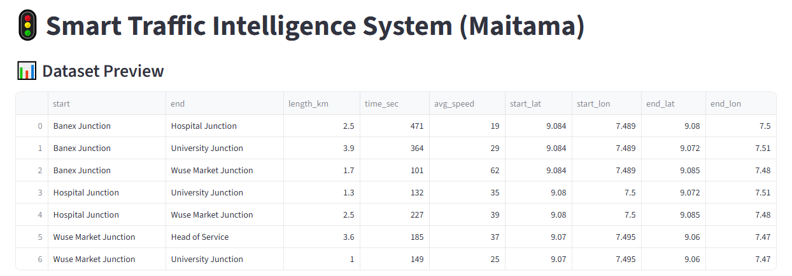
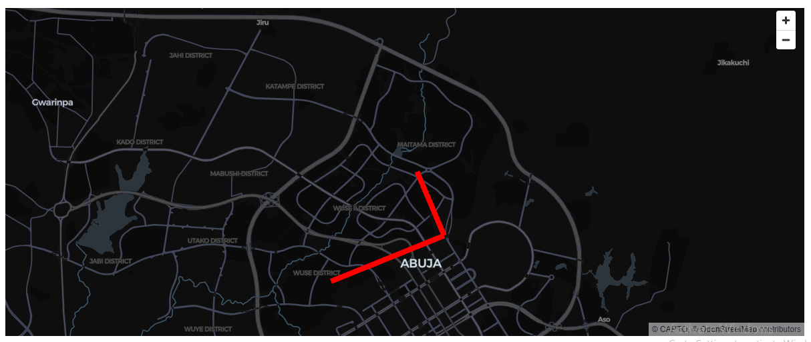

# 🚍 Speed Prediction - Maitama District Route Analysis & ML App

An interactive **Machine Learning powered Streamlit dashboard** for analyzing road routes in **Maitama District, Abuja** and predicting **Average Vehicle Speed (km/h)** based on route distance and travel time.

This project combines **data analytics**, **visualization**, **predictive modeling**, and **PDF report generation** into one smart traffic analysis tool.

---

## 📌 Live App

🔗 **Launch Application:**  
https://kola-speed-prediction.streamlit.app/

---

## 📌 Project Overview

Urban traffic management is essential for smart city development. This application helps users:

✅ Analyze route data  
✅ Visualize traffic patterns  
✅ Predict average speed using Machine Learning  
✅ Export dashboard reports as PDF  
✅ Make data-driven transport decisions

---

## 🚀 Features

### 📋 Dataset Display

View Maitama District route dataset containing:

- Route Names  
- Route Length (km)  
- Travel Time (seconds)  
- Average Speed (km/h)

---

### 📊 Interactive Visualizations

Generate:

- Scatter Plot  
- Regression Plot  
- Correlation Heatmap  

Variables include:

- Route Length  
- Travel Time  
- Average Speed

---

### 🧠 Machine Learning Model

**Model Used:** Linear Regression

### Input Features

- Route Length (km)  
- Travel Time (sec)

### Predicted Output

- Average Speed (km/h)

---

### 📈 Model Performance Metrics

The app evaluates prediction quality using:

- R² Score  
- Mean Absolute Error (MAE)

---

### 🔮 Speed Prediction System

Users enter:

- Route Length  
- Travel Time  

And instantly receive:

**Predicted Average Speed (km/h)**

---

### 📄 PDF Report Export

Generate downloadable reports containing:

- Model performance metrics  
- Charts  
- Heatmap  
- Prediction history

---

## 🖼️ Project Screenshots

### Dashboard


### Dashboard View 2


### Dashboard View 3


### Prediction Output


### Optimization Result


### Map Visualization


### Map View 2


---

## 🛠️ Tech Stack

- Python  
- Streamlit  
- Pandas  
- Matplotlib  
- Seaborn  
- Scikit-learn  
- ReportLab

---

## 📂 Project Structure

```bash
Speed-prediction/
│── ki.py
│── requirements.txt
│── README.md
│── dashboard.png
│── dashboard1.png
│── dashboard2.png
│── map.png
│── map1.png
│── optimization.png
│── predict.png

---
## ⚙️ Installation Guide

Clone the repository:

```bash
git clone https://github.com/yourusername/Speed-prediction.git
cd Speed-prediction
---
## Install dependencies:
pip install -r requirements.txt
---
Run the app:
streamlit run ki.py
## 📌 Use Case Applications

- Smart Traffic Monitoring  
- Route Optimization  
- Urban Planning  
- Logistics Analysis  
- Transport Decision Support  
- GIS Traffic Analytics  

---

## 📈 Future Improvements

- Real-time Google Maps API Integration  
- Traffic Congestion Forecasting  
- Accident Hotspot Detection  
- Power BI Dashboard Version  
- Smart City Live Monitoring  
- Multi-route Optimization Engine  

---

## 👨‍💻 Author

**Kolade Olonisakin**  
Data Scientist | Machine Learning Engineer | GIS Enthusiast
