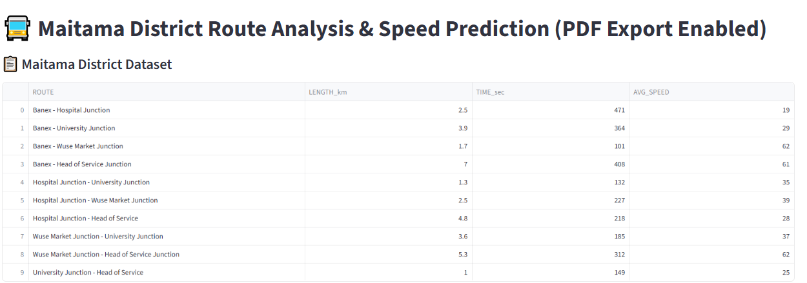
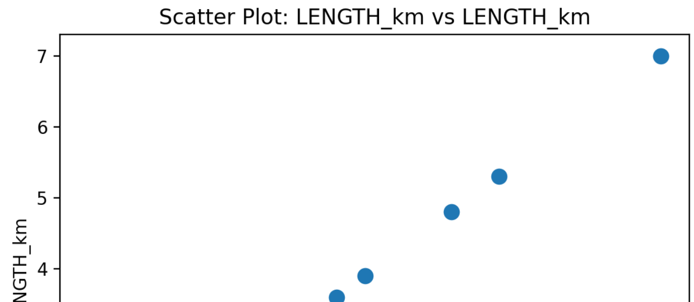
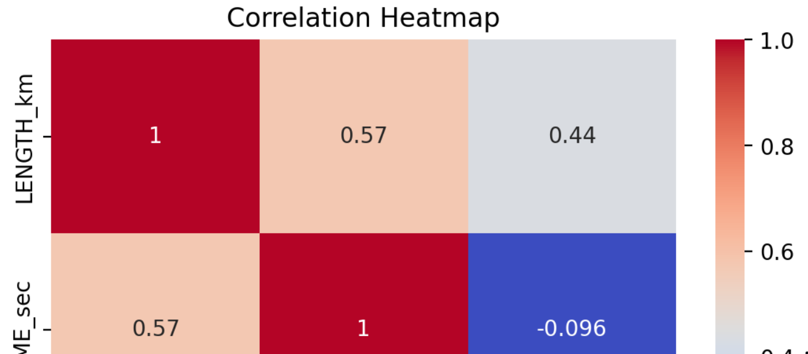
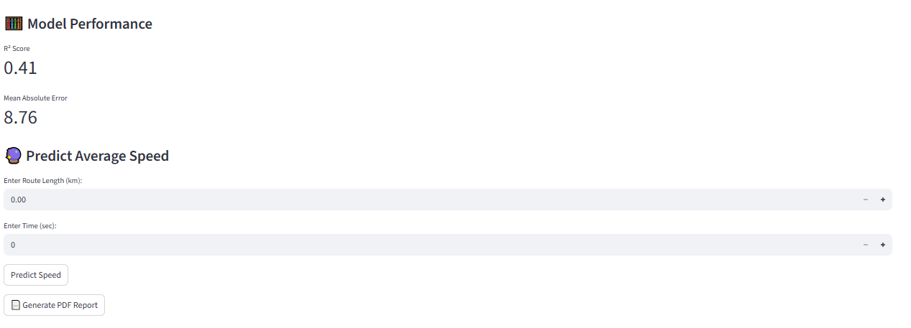
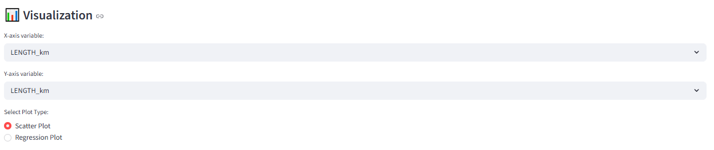

# 🚍 Speed Prediction – Maitama District Route Analysis & ML App

An interactive **Machine Learning-powered Streamlit application** that analyzes road routes in **Maitama District, Abuja** and predicts **Average Vehicle Speed (km/h)** using route distance and travel time.

This project demonstrates how **Machine Learning, Data Analytics, Interactive Visualization, and Automated Reporting** can be combined into a practical decision-support tool for intelligent transportation systems.

---

# 🌐 Live Application

🔗 https://kola-speed-prediction.streamlit.app/

---

# 📌 Project Overview

Efficient traffic management is a key component of smart city development. Understanding the relationship between route length, travel time, and vehicle speed can help transportation planners make informed decisions.

This application enables users to:

- Analyze traffic route data
- Explore relationships between transportation variables
- Predict average travel speed using Machine Learning
- Visualize traffic patterns through interactive charts
- Generate downloadable PDF reports
- Support data-driven transportation planning

---

# 🚀 Key Features

## 📋 Dataset Explorer

View the Maitama District traffic dataset containing:

- Route Names
- Route Length (km)
- Travel Time (seconds)
- Average Speed (km/h)

---

## 📊 Interactive Data Visualization

Generate interactive visualizations including:

- Scatter Plot
- Regression Plot
- Correlation Heatmap

These charts help users understand the relationships between:

- Route Length
- Travel Time
- Average Speed

---

## 🤖 Machine Learning Prediction

The application uses **Linear Regression** to estimate vehicle speed.

### Input Features

- Route Length (km)
- Travel Time (seconds)

### Predicted Output

- Average Speed (km/h)

---

## 🔮 Speed Prediction

Users enter:

- Route Length
- Travel Time

The application instantly predicts the expected average vehicle speed.

---

## 📄 Automated PDF Report

Generate professional reports containing:

- Model performance summary
- Charts
- Correlation analysis
- Prediction history

---

# 📸 Application Screenshots

## 🖥️ Dashboard



---

## 📉 Scatter Plot



---

## 📊 Correlation Heatmap



---

## 🔮 Speed Prediction



---

## 📈 Visualization Dashboard



---

# 🧠 Machine Learning Model

## Algorithm

**Linear Regression**

### Input Features

- Route Length (km)
- Travel Time (seconds)

### Predicted Output

- Average Vehicle Speed (km/h)

---

# 📊 Model Performance & Key Learning

This project was developed as a prototype to demonstrate the complete workflow of a Machine Learning application, from data analysis and visualization to prediction and automated reporting.

One important observation during development was that the model's evaluation metrics changed slightly between application runs. This was not due to an error in the code but because the training and testing datasets were randomly generated each time the application was executed.

With a relatively small demonstration dataset, different train-test splits naturally produce different performance metrics.

This reinforces an important principle in Machine Learning:

> **Model performance depends not only on the choice of algorithm but also on the quality, quantity, and representativeness of the training data, as well as the evaluation strategy used.**

Future versions of this project will adopt a fixed random seed (`random_state`) for reproducible experiments, expand the dataset with additional traffic observations, and compare multiple regression algorithms to improve prediction accuracy.

Beyond the predictive model, this project demonstrates the successful integration of:

- Machine Learning
- Data Analytics
- Interactive Visualization
- Automated PDF Reporting
- Streamlit Web Deployment

---

# 🛠️ Technology Stack

- Python
- Streamlit
- Pandas
- Matplotlib
- Seaborn
- Scikit-learn
- ReportLab

---

# 📂 Project Structure

```text
Speed-Prediction/
│── ki.py
│── requirements.txt
│── README.md
│── assets/
│   ├── Dashboard.png
│   ├── Scatterplot.png
│   ├── Correlation.png
│   ├── Prediction.png
│   └── Visualization.png
```

---

# ⚙️ Installation

## Clone Repository

```bash
git clone https://github.com/kola56de/Speed-prediction.git

cd Speed-prediction
```

## Install Dependencies

```bash
pip install -r requirements.txt
```

## Run Application

```bash
streamlit run ki.py
```

---

# 🎯 Applications

- Intelligent Transportation Systems
- Traffic Speed Prediction
- Smart Mobility
- Transportation Planning
- Urban Traffic Analysis
- Logistics Planning
- Decision Support Systems

---

# 📈 Future Improvements

- Real-time Google Maps Traffic API Integration
- Traffic Congestion Forecasting
- Accident Hotspot Analysis
- Power BI Executive Dashboard
- Multi-route Speed Prediction
- Larger Training Dataset
- Advanced Regression Models
- GPS Data Integration

---

# 👨‍💻 Author

## **Engr. Dr. Kolade Olonisakin, FNSE**

**Civil Engineer | Data Scientist | Machine Learning Engineer | AI Engineer | Transportation & GIS Analytics**

🌍 **Portfolio**

https://kola56de.github.io/Engr-Dr-Kolade-Portfolio.github.io/

💼 **LinkedIn**

https://www.linkedin.com/in/engr-dr-kolade-olonisakin-fnse/

💻 **GitHub**

https://github.com/kola56de

---

# ⭐ Support

If you found this project useful, please consider giving it a **⭐ Star** on GitHub.

Feedback, suggestions, and collaboration opportunities are always welcome.
