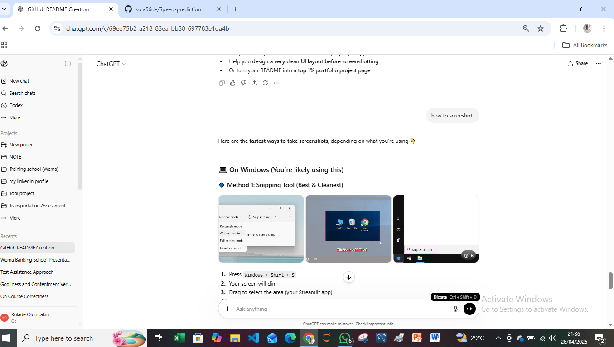
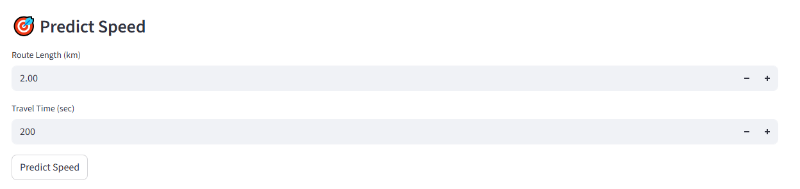

# 🚍 Speed Prediction - Maitama District Route Analysis & ML App

A machine learning-powered **Streamlit web application** for analyzing road routes in **Maitama District, Abuja**, visualizing transport data, predicting average vehicle speed, and exporting reports as PDF.

This project combines **Data Analysis**, **Visualization**, **Machine Learning**, and **Report Automation** into one smart traffic analytics solution.

---

## 📌 Project Overview

This application helps analyze selected routes in Maitama District using route distance and travel time data.

Users can:

✅ Explore transport datasets  
✅ Visualize route performance  
✅ Generate correlation heatmaps  
✅ Predict average speed using Machine Learning  
✅ View recent predictions  
✅ Export full reports as PDF

---

## 🚀 Live Features

### 📋 Dataset Display
View available routes with:

- Route Name
- Length (km)
- Travel Time (sec)
- Average Speed (km/h)

### 📊 Data Visualization

Interactive charts include:

- Scatter Plot
- Regression Plot
- Correlation Heatmap

### 🤖 Machine Learning Model

**Linear Regression**

Input Features:

- Route Length (km)
- Travel Time (sec)

Predicted Output:

- Average Speed (km/h)

### 📈 Model Performance Metrics

- R² Score
- Mean Absolute Error (MAE)

### 🔮 Speed Prediction

Users can input:

- Route Length
- Travel Time

And instantly predict expected speed.

### 📄 PDF Report Export

Generate downloadable reports containing:

- Model metrics
- Charts
- Prediction history

---

# 🖼️ Application Screenshots

## 🏠 Dashboard




---

## 🗺️ Route / Map View


---

## 📈 Optimization / Analytics


---

## 🔮 Prediction Section



---

# 🛠️ Tech Stack

- Python
- Streamlit
- Pandas
- Matplotlib
- Seaborn
- Scikit-learn
- ReportLab

---

# 📂 Project Structure

```bash
Speed-prediction/
│── assets/
│   ├── dashboard.png
│   ├── dashboard1.png
│   ├── dashboard2.png
│   ├── map.png
│   ├── map1.png
│   ├── optimization.png
│   └── predict.png
│
│── ki.py
│── requirements.txt
│── README.md

## ⚙️ Installation Guide

### 1️⃣ Clone Repository

```bash
git clone https://github.com/yourusername/Speed-prediction.git
cd Speed-prediction

### 2️⃣ Install Requirements
pip install -r requirements.txt

### 3️⃣ Run App
streamlit run ki.py
## 📌 Future Improvements

- Real-time traffic API integration  
- Google Maps route tracking  
- Congestion forecasting  
- Accident hotspot detection  
- Dashboard upgrade with Power BI  
- Smart city traffic monitoring  

---

## 👨‍💻 Author

**Kolade Olonisakin**  
Data Scientist | AI Engineer | GIS Enthusiast  

---

## ⭐ Support

If you like this project, kindly give it a **star ⭐** on GitHub.
